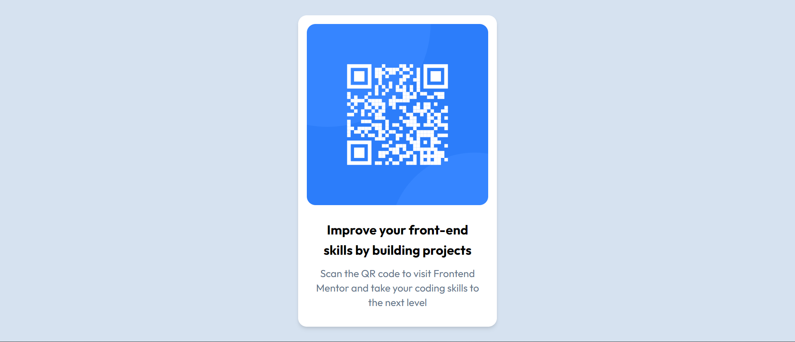

# Frontend Mentor - QR code component solution

This is a solution to the [QR code component challenge on Frontend Mentor](https://www.frontendmentor.io/challenges/qr-code-component-iux_sIO_H). Frontend Mentor challenges help you improve your coding skills by building realistic projects.

## Table of contents

- [Overview](#overview)
  - [Screenshot](#screenshot)
  - [Links](#links)
- [My process](#my-process)
  - [Built with](#built-with)
  - [What I learned](#what-i-learned)
  - [Useful resources](#useful-resources)
- [Author](#author)
- [Acknowledgments](#acknowledgments)

## Overview

### Screenshot

### Links

- Solution URL: [Github Repository](https://github.com/Mdkaif-123/Frontend-Mentor-Challege-1)
- Live Site URL: [Live Link](https://frontend-mentor-challege-1.vercel.app/)

## My process

### Built with

- Semantic HTML5 markup
- React JSX Component
- Tailwind Flex
- Mobile-first workflow
- [Next.js](https://nextjs.org/) - React framework

### What I learned

Through completing the Frontend Mentor challenge where I built a QR code page using Next.js and Tailwind CSS, I gained valuable insights into various aspects of web development. Firstly, my proficiency in Next.js significantly improved as I successfully implemented a project with this React framework. I delved into its features, potentially exploring server-side rendering (SSR) or static site generation (SSG). Additionally, mastering Tailwind CSS was a highlight, as I refined my skills in efficiently styling the application using the utility-first approach. The seamless integration of QR codes into the page showcased my ability to work with diverse technologies. Overall, this project not only enhanced my technical skills but also underscored the importance of practical application in reinforcing theoretical knowledge.

### Useful resources

- [Next.Js Documentation](https://nextjs.org/) - Used by some of the world's largest companies, Next.js enables you to create full-stack Web applications by extending the latest React features, and integrating powerful Rust-based JavaScript tooling for the fastest builds.
- [Tailwind Css](https://tailwindcss.com/) - Tailwind CSS is a utility-first CSS framework that streamlines web development by providing a set of pre-defined utility classes for styling.

## Author

- My LinkedIn - [Md Kaif Ansari](https://www.linkedin.com/in/md-kaif-ansari/)
- My Frontend Mentor Profile - [@Mdkaif-123](https://www.frontendmentor.io/profile/Mdkaif-123)
- My Twitter - [@MdKaifA16697201](https://twitter.com/MdKaifA16697201)

## Acknowledgments

I extend my gratitude to the Frontend Mentor community for providing the platform and challenges that facilitated my growth as a developer. Special thanks to the creators of Next.js and Tailwind CSS, whose frameworks empowered me to bring this project to life. The journey of building a QR code page was a valuable learning experience, and I appreciate the support from my peers and mentors who contributed to my development as a full-stack developer.
